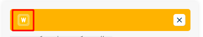
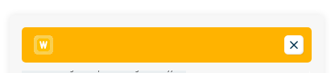
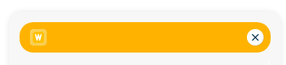
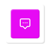
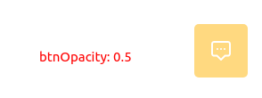
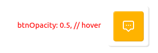

# Конфигурация виджета
Кофигурация виджета осуществляется через передачу объекта с параметрами
при его инициализации.

```javascript
const config = {
  borderRadiusStyle: 'square', // ['square', 'rounded'],
  lang: 'en', // ['en', 'ru', 'ua', 'kz'],
  position: 'right', // ['right', 'left']
  accentColor: 'hsl(42, 100%, 50%)',
  btnOpacity: 1,
  wsUrl: 'wss://cloud.webitel.ua/chat/ws',
  logoUrl: '',
  openTimeout: false, // numeric value in seconds
};
```


## Параметры:
## WebSocket URL сервера `wsUrl`
URL, по которому виджет будет пытаться открыть WebSocket соединение.

**Обязателен к переопределению.**

## `logoUrl`
Ссылка на логотип, который будет отображаться в хедере Окна виджета, в размере `24х24 px`.

Значение по умолчанию: webitel logo


### Border style: `borderRadiusStyle`
Изменяет отображение краёв элементов. 

Доступные опции:
* `square` - прямоугольные края, небольшое скругление


  
  


* `rounded` - круглые края, полное скругление


  
  

Значение по умолчанию: `square`.

_Все скругления происходят через добавляемый класс `rounded`._

## Language: `lang`
Локализация приложения.

Доступные опции:
* `en` - Английский 🇺🇸
* `ru` - Русский 🇷🇺
* `ua` - Украинский 🇺🇦
* `kz` - Казахский 🇰🇿

Значение по умолчанию: `en`.

**Внимание!** Локализация влияет **ТОЛЬКО** на язык интерфейса виджета (плейсхолдер, подсказки, и т.д.).
Эта локализация не имеет никакого отношения к локализации схемы, бота и т.п.

## Позиция: `position`
Позиция виджета на экране.

Доступные опции:
* `right` - Справа
* `left` - Слева

Значение по умолчанию: `right`.

## Цвет: `accentColor`

Значение передается CSS переменной, поэтому валидным значением будет любой формат цвета, поддерживаемый CSS.

* `accentColor: 'red'`


  

* `accentColor: '#00aeff'`


  

* `accentColor: 'rgb(230, 10, 244)'`


  

Значение по умолчанию: `hsl(42, 100%, 50%)`

## Прозрачность кнопки в состоянии покоя: `btnOpacity`
Значение в диапазоне `0` - `1`, которое потом передается в CSS переменную `opacity`.

Значение по умолчанию: `1`.





**Внимание!**, при наведении `:hover` на кнопку, и при работе с Окном виджета, прозрачность будет равна `1`.
Это значение влияет только на отображение самой кнопки **в состоянии покоя**.

## Задержка открытия Окна виджета и WebSocket соединения: `openTimeout`
Если передано, Окно виджета (чат, а вместе с ним и соединение с сервером и запуск схемы маршрутизации)
будет открыто через указанный промежуток времени **в секундах**.

Значение по умолчанию: `false`.
По умолчанию Окно виджета открывается только при нажатии на Кнопку.
