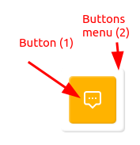
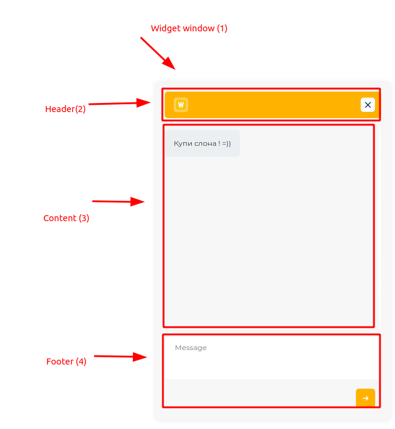

# Структура
Структура виджета состоит из 2х компонентов, обёрнутых в контейнер:
1. Меню кнопок, и Кнопка
2. Непосредственно Окна виджета

## Контейнер `wt-omni-widget`
Меню кнопок и Окно виджета обёрнуты в контейнер `#wt-omni-widget`.

Все стили виджета, а также CSS-переменные задаются через `id` контейнера,
чтобы, с одной стороны, избежать влияния глобальных сайта на виджет из-за
высокой специфичности `id`-селектора, и, с другой, чтобы инкапсулировать стили
виджета и избежать загрезнения и пространства глобальных переменных.

**Фиксированно (`position: fixed`) расположен именно контейнер виджета.** 
Его контент расположен статично.

## Меню кнопок, и Кнопка
Вот так выглядит Кнопка (1), и Меню кнопок (2)



### Меню кнопок
**Меню кнопок** оборачивает Кнопку, так как в будущем кнопок будет несколько
(например, Чат с сайта, Viber, Whatapp, Telegram, Звонок).
```jade
#wt-omni-widget
    .wt-omni-widget-buttons-menu
        .wt-omni-widget-btn
```
**На данный момент не Меню не выполняет никакой функции, кроме визуальной.**
При этом, появляется Меню только при наведении на саму Кнопку, так как
имеет `pointer-events: none`, переопределенный на `auto` в стилях самой Кнопки.

### Кнопка
Просто кнопка, внутри иконка.

## Окно виджета
Вот так выглядит **Окно виджета** (1):



**Окно виджета состоит из **хедера** (2), **футера** (4) и **контента**(3).

При этом, **контент и футер обёрнуты в контейнеры** для разделения стилизации
внешнего контейнера контента или футера от внутренних стилей. Хедер
всегда имеет один стиль, поэтому у него нет обёртки-контейнера:
```jade
#wt-omni-widget
    .wt-omni-widget-window
        .wt-omni-widget-window-header
        .wt-omni-widget-window-content-wrapper
            .wt-omni-widget-window-content // content
        .wt-omni-widget-window-footer-wrapper
            .wt-omni-widget-window-footer // content
```
